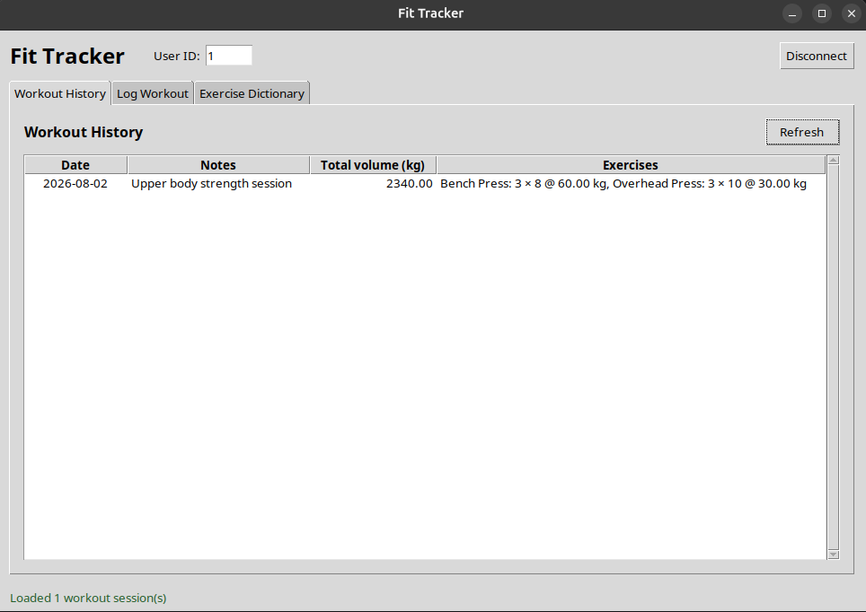
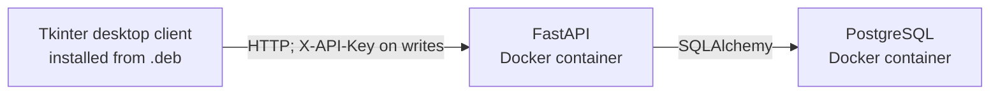
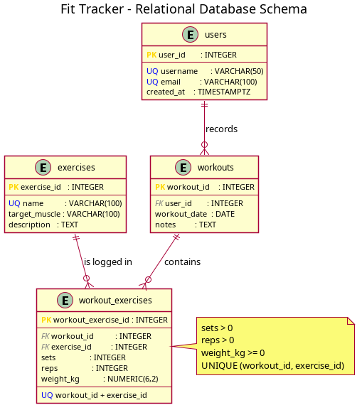

# 🏋️ Fit Tracker - DBMS Term Project

[](https://github.com/wojak0/fittracker/actions/workflows/ci.yml)
[](https://github.com/wojak0/fittracker/actions/workflows/docs.yml)
[](https://github.com/wojak0/fittracker/actions/workflows/release.yml)
[](LICENSE)

**Author:** Ahmad Hoteit  
**Module:** Introduction to Database Management Systems  
**Lecturer:** Stephan Bökelmann  
**Institution:** Technische Hochschule Georg Agricola (THGA), Bochum  
**Semester:** Summer Term 2026  
**Current version:** 1.0.0

Fit Tracker is a self-hosted strength-training tracker built with PostgreSQL,
FastAPI and a Tkinter desktop client. It records workout sessions, exercises,
sets, repetitions and weight, and calculates the total training volume of every
session.

The backend runs through Docker Compose. The desktop frontend is distributed as
an installable Debian package and communicates with the backend through a REST
API. Write operations are protected by an `X-API-Key`.



## ✨ Features

- PostgreSQL database with four normalized relational tables
- FastAPI backend with two read and two protected write endpoints
- `X-API-Key` authentication for write operations
- Joined workout history with automatic volume aggregation
- Fifteen seeded exercises covering the main muscle groups
- Tkinter desktop frontend for browsing and recording workouts
- Docker Compose deployment with a persistent PostgreSQL volume
- Installable AMD64 Debian package (`.deb`)
- Automated backend, frontend and Docker integration tests
- GitHub Actions for CI, LaTeX documentation and release artifacts
- User Manual and Developer Manual written in LaTeX

## 🏗️ Architecture



Docker Compose operates the two backend services:

- `postgres`: PostgreSQL database
- `api`: FastAPI REST API

The Tkinter frontend runs on the host system and communicates only with the API.
It never connects directly to PostgreSQL.

## 🗄️ Database model

The application uses exactly four relational tables:

| Table | Purpose |
| --- | --- |
| `users` | Stores application users |
| `exercises` | Stores the exercise dictionary |
| `workouts` | Stores workout sessions belonging to users |
| `workout_exercises` | Resolves the N:M relationship and stores sets, repetitions and weight |

Relationship structure:

```text
users 1 ── N workouts 1 ── N workout_exercises N ── 1 exercises
```

The schema enforces primary keys, foreign keys, unique values, required values,
positive sets and repetitions, non-negative weights, and one entry per exercise
within a workout.



## 🔌 REST API

| Method | Endpoint | API key | Purpose |
| --- | --- | --- | --- |
| `GET` | `/exercises` | No | Return the exercise dictionary |
| `GET` | `/users/{user_id}/workouts` | No | Return joined workout history and total volume |
| `POST` | `/workouts` | Yes | Create a workout session |
| `POST` | `/workouts/{workout_id}/exercises` | Yes | Add exercise performance to a workout |

Write requests require this HTTP header:

```text
X-API-Key: configured-api-key
```

Training volume is calculated in PostgreSQL as:

```text
sets × repetitions × weight_kg
```

Interactive API documentation is available while the backend is running:

```text
http://localhost:8888/docs
```

## ✅ Requirements

### 🐳 Backend host

- Linux or another Docker-compatible system
- Docker Engine
- Docker Compose plugin
- Git

### 🖥️ Desktop frontend

- Debian or Ubuntu on AMD64/x86-64
- A graphical desktop environment
- Access to the running FastAPI backend

### 🔧 Development tools

- Python 3.11 or newer
- `uv` for the frontend environment
- `pytest`
- PlantUML for regenerating the schema diagram
- LaTeX (`latexmk` and the required TeX Live packages) for the manuals
- Ruby `fpm` and PyInstaller for building the Debian package

## 🚀 Starting the backend

Clone the repository and enter it:

```bash
git clone https://github.com/wojak0/fittracker.git
cd fittracker
```

Create the local environment file:

```bash
cp .env.example .env
nano .env
```

Replace the example PostgreSQL password and API key with private values. The
username, password and database name in `DATABASE_URL` must match the configured
PostgreSQL values.

Build and start the backend:

```bash
docker compose up -d --build
```

Or use the Makefile shortcut:

```bash
make up
```

Check the services:

```bash
docker compose ps
```

The API should report `Up`, and PostgreSQL should report `healthy`.

## 🖥️ Installing and using the desktop frontend

Download `fittracker-frontend_1.0.0_amd64.deb` from the latest GitHub Release,
then install it with APT:

```bash
sudo apt install ./fittracker-frontend_1.0.0_amd64.deb
```

Start the application from the desktop application menu or from a terminal:

```bash
fittracker
```

In the connection dialog, enter:

- **API URL:** `http://localhost:8888`
- **X-API-Key:** the value configured as `API_KEY` in `.env`

After connecting, the application provides:

- **Workout History:** review sessions, exercises and total volume
- **Log Workout:** create a session containing one or more exercises
- **Exercise Dictionary:** browse the fifteen seeded exercises

The default demonstration account uses `user_id = 1`.

To uninstall the desktop client:

```bash
sudo apt remove fittracker-frontend
```

## 🌱 Initial data

On first database initialization, `init.sql` creates the schema and inserts:

- One demonstration user with `user_id = 1`
- Bench Press
- Incline Dumbbell Press
- Push-Up
- Squat
- Leg Press
- Walking Lunge
- Deadlift
- Romanian Deadlift
- Barbell Row
- Lat Pulldown
- Overhead Press
- Lateral Raise
- Biceps Curl
- Triceps Pushdown
- Standing Calf Raise

PostgreSQL runs `init.sql` only when it creates a new database volume.

## 💾 Data persistence

Workout data is stored in the Docker named volume:

```text
fittracker_postgres_data
```

The data remains available after stopping containers or restarting the computer.
After a reboot, return to the repository and start the backend again:

```bash
make up
```

Stop the containers without deleting data:

```bash
make down
```

The `.deb` package contains only the desktop frontend. It does not contain the
database, and the application needs access to a running backend.

> **Warning:** `docker compose down -v` permanently deletes the project database
> volume and all saved workouts. Use it only when an intentional clean reset is
> required.

## 🧪 Automated tests

Create the backend development environment:

```bash
python3 -m venv .venv
.venv/bin/pip install -r requirements-dev.txt
```

Synchronize the locked frontend environment:

```bash
cd frontend
uv sync --frozen
cd ..
```

Run all backend and frontend tests:

```bash
make test
```

The current test suites contain:

- 8 backend/API and database tests
- 6 frontend API-client tests
- A GitHub Actions Docker integration test against real PostgreSQL and FastAPI containers

GitHub Actions automatically runs these checks on pushes and pull requests to
`main`.

## 📦 Building the Debian package

Build the Tkinter executable and Debian installer:

```bash
make deb
```

The generated installer is written to:

```text
frontend/dist/fittracker-frontend_1.0.0_amd64.deb
```

Inspect its package metadata:

```bash
make deb-info
```

The package declares the MIT license, AMD64 architecture, maintainer, homepage
and required Linux libraries.

## 📚 Documentation

The project provides three final documents:

- [Approved Fit Tracker proposal](documentation/proposal.pdf)
- [User Manual source](documentation/user-manual.tex)
- [Developer Manual source](documentation/developer-manual.tex)

Build both LaTeX manuals locally:

```bash
make docs
```

Generated PDFs are written to `out/`:

```text
out/user-manual.pdf
out/developer-manual.pdf
```

The **Documentation PDF Build** workflow builds and uploads a downloadable
artifact containing the approved proposal and both manuals. Tagged releases also
attach all three documents next to the Debian installer.

## 🛠️ Useful Makefile commands

| Command | Purpose |
| --- | --- |
| `make help` | List available targets |
| `make up` | Build and start PostgreSQL and FastAPI |
| `make down` | Stop backend containers without deleting data |
| `make logs` | Follow PostgreSQL and API logs |
| `make test` | Run backend and frontend tests |
| `make schema` | Render `schema.puml` as `schema.svg` |
| `make frontend-run` | Run the Tkinter client from source |
| `make frontend-build` | Build the PyInstaller application |
| `make deb` | Build the Debian installer |
| `make deb-info` | Display Debian package metadata |
| `make docs` | Build the User and Developer Manuals |

## 📁 Repository structure

```text
.
├── .github/workflows/          # CI, documentation and release automation
├── documentation/
│   ├── images/                 # User and developer manual screenshots
│   ├── proposal.pdf            # Approved proposal with original sketches
│   ├── user-manual.tex         # User Manual source
│   └── developer-manual.tex    # Developer Manual source
├── frontend/
│   ├── packaging/              # Desktop launcher definition
│   ├── src/fittracker_frontend/ # Modular Tkinter application
│   ├── tests/                  # Frontend API-client tests
│   ├── pyproject.toml
│   └── uv.lock
├── style/thga-db.sty           # THGA LaTeX design package
├── tests/                      # Backend and database tests
├── database.py                 # SQLAlchemy engine and sessions
├── models.py                   # ORM models and constraints
├── schemas.py                  # Pydantic request/response schemas
├── main.py                     # FastAPI routes and authentication
├── init.sql                    # PostgreSQL schema and seed data
├── queries.sql                 # Example relational queries
├── schema.puml                 # Relational schema source
├── Dockerfile                  # Non-root FastAPI image
├── docker-compose.yml          # PostgreSQL and API services
├── Makefile                    # Development, test, build and documentation commands
├── LICENSE                     # MIT License
└── README.md
```

Generated files such as `.env`, `out/`, virtual environments, test caches,
PyInstaller output and Debian packages are excluded from Git.

## 🔐 Security notes

- Real database credentials and the API key are stored only in `.env`.
- `.env` is excluded from Git; only `.env.example` is committed.
- Write endpoints reject missing or incorrect API keys.
- API-key comparison uses a timing-safe comparison.
- The API container runs as an unprivileged Linux user.
- PostgreSQL is not exposed to the host network by Docker Compose.
- Use long random secrets and do not commit or publish them.

The current API key protects the application as a whole; it is not individual
user authentication. The default deployment uses local HTTP and should not be
exposed directly to the public internet.

## 📌 Project status and roadmap

The complete project core is implemented and tested:

- PostgreSQL schema, constraints, queries and persistent storage
- FastAPI endpoints and `X-API-Key` protection
- Docker Compose deployment
- Modular Tkinter frontend
- Debian package creation and installation
- Automated backend, frontend and Docker checks
- Documentation and release workflows
- Approved proposal, User Manual and Developer Manual

Possible future extensions documented in the Developer Manual include:

- Deleting workout sessions through a protected API endpoint
- Creating and selecting multiple application users
- Per-user authentication and authorization
- Body-measurement and training-goal tables
- An optional Android client using the same REST API

## 📄 License

This project is available under the [MIT License](LICENSE).

## 🙏 Sources and reuse

The architecture and development workflow build on concepts taught in the DBMS
lectures and exercises, especially the PostgreSQL, FastAPI, Docker Compose,
Tkinter, packaging and API-key examples. The THGA LaTeX style originates from
the supplied DBMS course material and is retained to format the project manuals.
